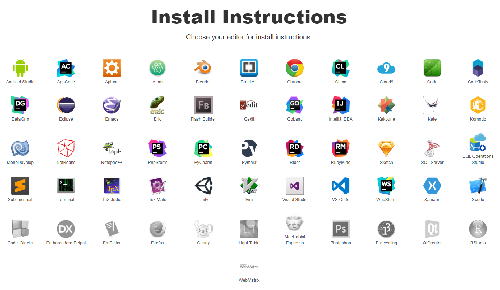
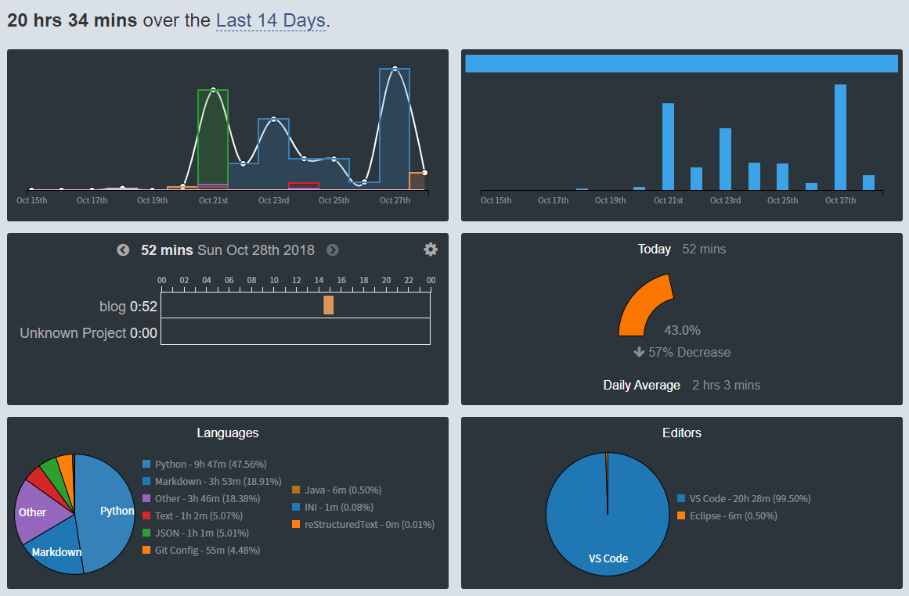
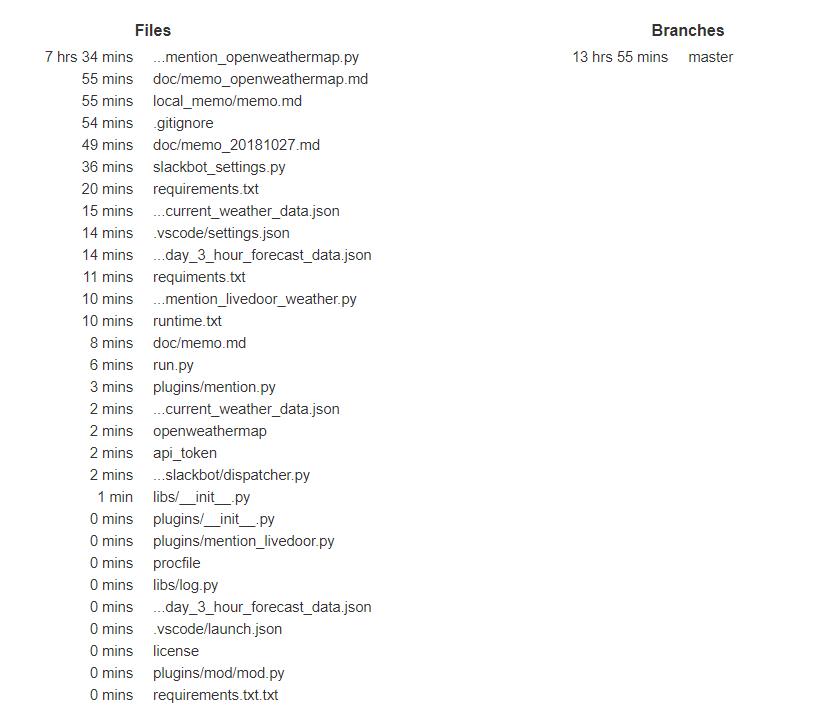
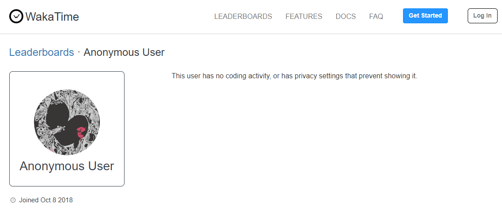

# 2018年10月の振り返り

## 概要

月末に振り返りをしようかなと思い始めた。

## 危機感と目的意識

以前から自分が生活や仕事をしていく中で、少しずつ危機感のようなものが生まれていた。そのうちのひとつずつは大したものではないと思っているが、積み重なっていくことで現状のままいるのは今後にとってよくない、という漠然な危機感につながった、という受け止め方をしている。

### 自分が目標とするもの

そこで、自分が目標としている成長を実現するための継続的な行動が必要になると思い、実行に移していくことにした。

自分が目標としている成長について掘り下げると、それはソフトウェアエンジニアとして名乗るに恥ずかしくない汎用的なスキルや知識を得ること、ソフトウェアエンジニアとしての仕事に従事していることだと思っている。そのために今現在ではPythonの勉強を始めているし、付随している必要なスキルや知識についていくことを意識しながら作業を進めていく。

批判や愚痴ではないが、今担当している業務では、上に書いた自分の成長目標は達成できないと思っている。ただ、自分が目標としていない、意識していない部分の成長はあるかもしれないのでムダな時間を過ごしているとは思っていないことは補足しておく。

### 外に出ることを習慣づける

上に書いた自分の目標を達成するために、外に出ることを習慣づけることが必要だと思っている。

現場の環境だけでは、上に書いたとおり自分が目標としている成長のために進むことはできない（ただし、自分が想定していない部分の成長が得られることはよいことだと思っている）。なので、自分が覚えたいことについて扱っている勉強会や諸々のイベントに参加することで、モチベーションを得たり具体的な道筋を獲得する必要がある。そして、自分の問題意識や価値観がコミュニティの中で確かに共有されていることを再認識し続け、孤独でないことを思い出すことも重要視している。

イベントに参加することを習慣づければ、いずれ自分が前に出て話すことで貢献をすることを近い距離の目標にすることができる。この順番でだんだんと得られる経験値を増やせればいいと思っている。

気軽に会話できるのも今は「外」だけなので、「自分が窒息しないように」という目的もある。

## できるだけ簡単に記録を残す

いろいろな方法で自分が何を感じていたか、何をしたかという記録を残そうとしていたが、いずれも記録を残すためのコストが大きいため、途中でやめてしまったり定期的でなくなることが続いていた。

そのため、コストが少ない方法を模索し、2つ新しい記録方法を開始している。

### Daylio

[Daylio - Mood Tracker and Micro Diary](http://daylio.webflow.io/)

[Google Play](https://play.google.com/store/apps/details?id=net.daylio&hl=ja)

[App Store](https://itunes.apple.com/jp/app/daylio-%E6%B0%97%E5%88%86%E3%82%92%E8%A8%98%E9%8C%B2%E3%81%99%E3%82%8B%E6%97%A5%E8%A8%98/id1194023242?mt=8)

かなり簡単に日記をつけることができる。5段階でその日の気分を評価し何をしていたか（仕事、休暇、読書、買い物、イベント…これらのカテゴリは自由に作成できる）をタグ付け、何かあればメモを残して登録すれば日記を書いたことになるという手軽さで、今の所1か月半くらい続いている。

無料登録の時点でほぼほぼ自由に利用することができ、PDFをエクスポートすることもできる。私はCSV形式のエクスポートをしたかったので、1回きりの課金をした。399円だったので許容範囲。

#### 10月のDaylio

ゆくゆくはCSVを扱う簡単なプログラムを書く予定だが、とりあえず今月は各種スクショなどを貼っておく。

まずは10月の気分について。画像下部に凡例があるが、ピンクが「最高」で赤が「良い」、その後黄色・緑・黒の順に「普通」「悪い」「最悪」という順番になる。こう見ると気分の上げ下げになんとなくのリズムがある。「最悪」だった日は体調を崩した日。「良い」はお笑いのライブに行った日（前の記事）。元々自己評価が高くないので、なかなか「良い」以上をつける自信がないのでこんな感じになる。

曜日ごとの平均的な気分。平日と休日で分かれる感じ。それ以外はまだそこまで特筆すべき内容はないと思う。

仕事があった日の気分。「悪い」があるのは仕事以外によることもあるので一概には言えない。

勉強をしている日は「悪い」がない。勉強ができたからなのか、勉強をする時間の余裕があったからなのかということまでは判断しかねる。

### wakatime

https://wakatime.com

エディターやIDEなどにプラグインとして設定することで、どれだけ作業をしたのかを記録してくれるサービス。

画像の色がついているツールに対応している。グレースケールのツールは、これから対応するらしい。私は現状`vs code`と`eclipse`に設定している。`Chrome`も対応しているが、ダラダラ見ているだけで時間が積まれてしまい目的に反するので設定していない。

無料で利用できるが、無料会員は履歴が残る期間など機能が限定されている。記事を書いた時点では2週間となっている。

https://wakatime.com/pricing

#### 10月のwakatime

*「10月」と書いたが無料会員は2週間までしか履歴が残らないのでこれからどうしよう…*

ダッシュボードの見た目。この2週間はそれなりに勉強していたのでいい感じにグラフが残っている。ブログも`vs code`で書いているので、その時間も残る。本のメモを残すようにすれば、コーディングを伴わない勉強時間も残せるかもしれない。

上の画像だけでも、

- 毎日のコーディング時間
- プロジェクト（ワークスペースごと）の作業時間
- 前日との比較
- 言語ごとの時間（割合）
- エディターごとの時間（割合）

が一覧になっている。それぞれのリンクに飛べば、さらに細かい情報が拾える。

プロジェクトごとのページには、どのファイルを開いていたか、どのブランチを扱っていたかが時間別に表示されている。機能ごとにモジュールを分けられていないので1つのファイルに集中してしまっている。うまく行けば、どの機能や処理で悩んだのか、というデータも判明するかもしれない。

プライバシー設定もできる。シークレットウィンドウから見るとわかる。

その他、チームで使える有料プランもある模様。

## 来月へ

11月に入るが、まだ色々な取り組みを始めたばかりなので、継続と習慣づけが直近の目標となる。技術書を読み切るとかイベントの参加リズムを定着させるとか。
