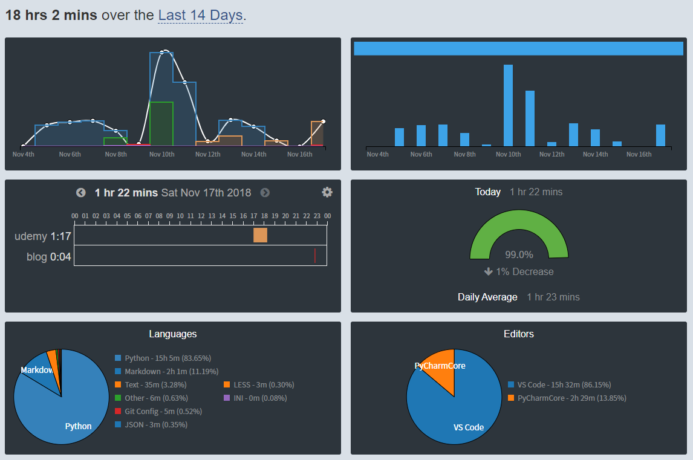

# 2018年11月前半の振り返り

## 概要

月末に振り返りをすると前に書いてしまったが、`wakatime`の無料プランが2週間までしか作業記録を取ってくれないので、その区切りで振り返りをすることにした。いつまで続くかわからないけど。

## wakatime

そんなwakatimeの記録。`wakatime`はエディターやプラグインとして設定することで、どれだけ作業をしたのかを記録してくれるサービス。[前回の記事](http://m4usta13ng.hatenablog.com/entry/201810_reflection)にも書いています。

https://wakatime.com

### 直近2週間の記録

今週も主に作成中のSlackbotを中心に作業。左上の棒グラフの色がプロジェクトを示しているが、そのSlackbot作成が青いグラフ。

やはり週の後半になってくるとやる気が減退してくる。土日にまとめてが通用するのは小学校のチャレンジ以外はあまり聞いたことがないので、少しでも毎日何かしら手を動かしている時間を作りたい。

右下の円グラフ`Editors`は、使用したエディター別に時間が記録されている。`VS Code`と`PyChermCore`（おそらくコミュニティ版だからこういう名前なのかと）を併用しているのは一瞬変だが、これはUdemyのPython入門講座でPyCharmを使用しているため。別にVS Codeでも進められるが、前から試してみたかったIDEなので言われるままに使用している。

## Udemy

https://www.udemy.com/

動画講座を販売しているサイト。講座ごとに買い切りとなっているのが特徴であり、月額制のように「元を取らなきゃ」という焦燥感にさいなまれることがない（永遠に講座を観ない可能性はある）。

記事を書いている時点でセール開催中であり、厚めの技術書よりも安い価格で販売されているものもある。私が購入したのは[Python 3 入門 + 応用 +アメリカのシリコンバレー流コードスタイルを学び、実践的なアプリ開発の準備をする | Udemy](https://www.udemy.com/python-beginner/learn/v4/overview)。「シリコンバレー流」についてはピンとこないが、インストールから基本の制御構文、Pythonでできることをひととおり触ってみる、という構成。

この講座で調子づいてきたら専門的な講座に進んでみようと思う。

## ちょっとずつ書く習慣

「ちょっとずつコード書いて、動くことを確認して、を繰り返す」という個人開発のコツを、今まで何回か聞いたことはあったが実践できないでいた。「〇〇な感じでとりあえず作ってみるかー」と最初は思っていたのに、DBをどう使うか・画面のデザインはどうするか・セキュリティの設定は何をすればいいのか・などといったことが気になってしまい、結局作業が進まないまま終わってしまうことが続いていた。

ただ、最近はどういう理由かわからないができるようになってきたと思う。自分は知識も技術も経験もない、という諦めがつくようになってきたからだろうか。

あと、ブログにも勉強したことをちょっとずつ書いていきたい。毎回それなりの文字数がないと記事として出せない変な癖があるので。

## 雑談不足

事情により同じ会社の人が少ない現場にいるので、雑談をする機会がない。仕事上の会話は（これも多くはないが）あるものの、なんというか肩の力を抜いて話すタイミングがない。

こんな状況でものらりくらりできる人はできるのかもしれないが、自分はそういうアビリティの持ち主ではないし、現場というコミュニティにおける「ここはテキトーで大丈夫、ここらへんはしっかりやろう」という勘所がまるでわからないので、必要以上に疲れを感じてしまっているのだと思う。心理的安全性はこういう話に近いのだろうか。言葉だけ聞いていて中身についてはよくわかっていない。

プライベートでも雑談の機会は乏しい。1か月に1回唯一会う友人と食事をするときか、1か月に1回帰る実家でしかまとまりのない話をしてもいい時間がない。

ラジオは相変わらず毎日3、4時間聴いているが、上手な会話を聴いているだけでは話し上手になれず、久々に口を開いたと思ったら自分でもわかるくらいにグチャグチャな流れで話している。学生時代よりも話が下手になってしまったと思う。参ってしまう。

勉強会に何度か顔をだしても空間に入り込めないのもこういうことが響いているのだと思う。

### どう自信を持つか

無謀な自信を持つのは嫌だが、自信や肯定感があまりにも欠けている自覚がある。自然と話し相手を自分より何もかも優れた相手として接していることに気づく。

こうなってしまったターニングポイントはやはり大学時代に抱えたメンタルの問題やそれに伴って種々のアカウント・連絡先・記録を消してしまって人間関係を失ってしまったことだということは分かっていて、それが今も完全に解決しているのかというとそうではないことも把握している。もはや一生ものだろう。が、そろそろ解決に向かってもよいのでは。

### 外に出ること

現在のところ、外にでて勉強会やイベントに行くことに対して、潜水をしているような感覚を抱いている。一生懸命息を止めて、取り返しがつかなくならないうちに、そそくさ家に返って酸素を取り込むことを繰り返している。みんなどうやってエラ呼吸をしているのだろうか。

勉強会にいる初心者を見るに、私が初心者になれるのにはあと何年かかるのかわからなくなってきました。
