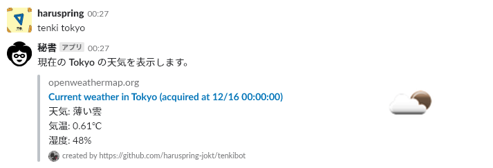
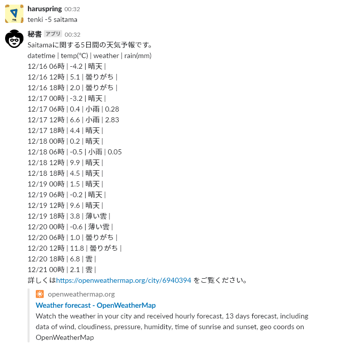
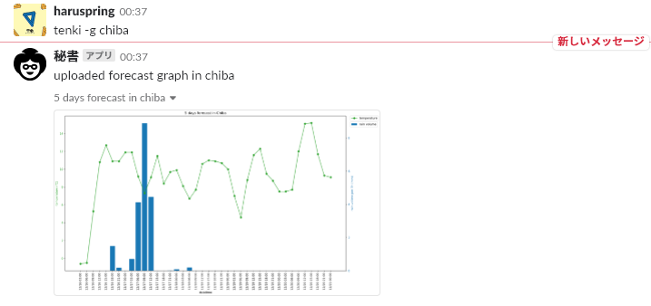
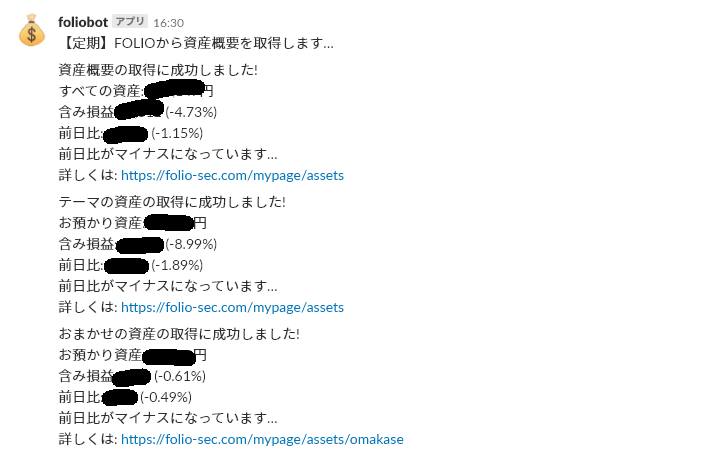
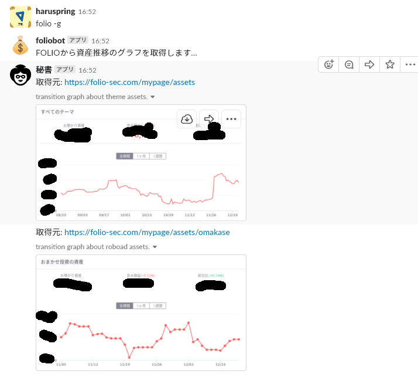
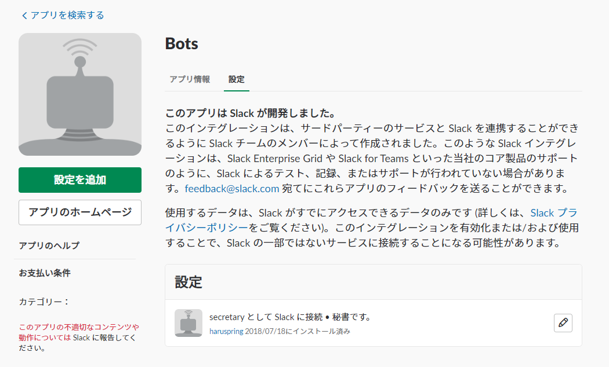
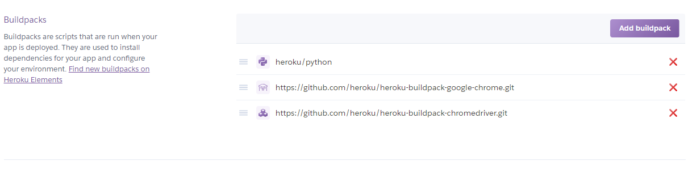

# Pythonをはじめてから2か月が経っている

この記事は Everyone Outputer Advent Calendar 13日目の記事です。

[Everyone Outputer Advent Calendar 2018 - Adventar](https://adventar.org/calendars/3225)

## はじめに

アドベントカレンダーのテーマが、

> コミュニティの名のごとく、なんでもアウトプットしてOKです！

とのことなので、タイトルはPythonが云々となっていますが、途中途中にしょーもないことを挟んでいると思います。

## 「2か月」について

Pythonをはじめて2か月というのはちっとも具体的でありません。実際にはどのくらいPythonを勉強して向き合っているのか、ということはもうよくわかりません。箇条書きにして書いてみると、

- 昨年4月に未経験で就職し、まずJavaの外部研修を他社の新人たちと受けるがよくわからなかった
- そのため、わかりやすいと評判だったPythonを[Paiza](https://paiza.jp/works)でさらっとやり、PythonのコレがJavaのコレだ、というアクロバティックな自習をしていた
- その後現場に出てからはずっとJava（Struts、Spring）だったためPythonはなかったことになる
  - 一番多いのはもちろん！ExcelとWordです
- なんとなくPythonを勉強するきっかけがほしかったので今年の5月あたりに[Python 3 エンジニア認定基礎試験](https://www.pythonic-exam.com/exam/basic)を受ける
  - 未経験から勉強するには最適だと思います
  - 合格する
- いずれやるんだろうな、という漠然とした気持ちで[JDLA Deep Learning for GENERAL 2018 #1](https://www.jdla.org/g20181/)を受ける
  - 技術的な知識がなくても大丈夫なカテゴリーの資格です
  - 合格する
- 何か作ろう、という漠然な気持ちで10月くらいからPythonを使って個人開発に取り組む

という経緯です。

10月に書き始めるまでは活動が飛び飛びになっていて、再開するたびにはじめからという気持ちでいたので、これはもう2か月でしょう、ということでこうなりました。

実際には、基本土日に作業をし、平日はできて1時間というペースなので、もっと密度の高い人はたくさんいるはずです。

さらに、先月末くらいから業務が忙しくなった（メンタル的にタフな状況になってきた、という方が正確）ことでほぼ進められておらず、元気が残っている日に[Udemy](https://www.udemy.com/)をダラダラと消費しているのが現状です。ということで、また再開するときに「ドッコイショ感」に悩まされそうです。

Udemyは動画をダウンロードして携帯から視聴できるのでありがたいです。Schooもそうだったような気がしますが、こちらは安定して視聴するまで苦心していた記憶があります。

## 2か月でやっていたこと

じゃあその2か月は何をやっていたのかということになりますが、個人用のSlack botを作成していました。

元々Slackチャンネルを個人用で持っており、個人用という名の通りユーザーは私だけ、他にはGoogle CalendarやIFTTT、GitHubなどのアプリが連携されており、バラバラに送られてくる通知をSlackにまとめてしまおうという魂胆で持っていました。

ただ既存のアプリ連携では、自分の生活に合わせてかゆいところまで手を届かせることは出来なかったので、そういった細かい点をカバーして貰おうという動機でした。

とはいっても実際には、箇条書きに書いた「何か作ろう」という漠然とした焦りみたいなものが根本的なモチベーションになっています。ここがもっと強固たるものなら没頭できるのですが。

### どんな感じで動く

#### 天気

指定した場所の天気を教えてくれます。



[OpenWeatherMap](https://openweathermap.org/)の無料APIを使用しているので、都市名もそれに準拠しています。

上の画面では最新の天気が表示されていますが、むこう5日間の天気も教えてくれます。



一気に見栄えがよろしくなくなってしまいました。わろしいです。試行錯誤しながら気ままに作成しているので、ほっといている機能はこういうことになります。

グラフの作成にも挑戦しています。



折れ線グラフ（気温）と棒グラフ（降水量）を同時に出しています。グリッド線を足せばわかりやすくなるのですが、2つのグラフを同時に出したことでグリッド線が棒グラフの上に来てしまうなどの問題が発生し、今のところこういった状態に落ち着いています。

にしても、グラフが上下をめいっぱい広がっているので、たいして気温差がなくても自然が気まぐれを起こしているように見えてしまいます。天気予報がどう出していたかをちゃんと見る必要があります。

#### お金

[FOLIO](https://folio-sec.com/)というサービスを通じて投資信託をはじめてしまった（今の所いわゆる勉強代を払ってしまっている）ので、日々の変動を教えてもらっています。



ちゃんと動いていることよりも落ち込んでしまうことが多いので、プラスになったときにだけ教えてもらおうかと思いましたが、それはよくない（わろい）ので毎日16時半に上下の唇を内側にぎゅーっと巻き込んでいます。

こっちから頼めばグラフも拾ってきてくれます。



現在できることはこのくらいです。並べると少ない…結構やったと思っていたのに…

### どうして動く

これらの機能のためにやったことを書いていきます。

#### Pythonライブラリ

Slackbotを動かすためには以下の2つを使用しています。

- [slackbot](https://github.com/lins05/slackbot)
- [slackclient](https://github.com/slackapi/python-slackclient)

`slackbot`は主にユーザーからのメッセージを拾うために使用しています。天気を返す機能は、まずユーザーが`tenki {都市名}`を投稿することで始まりますが、`slackbot`を使えばこの辺がとても簡単にできます。

```python
from slackbot.bot import respond_to
from slackbot.bot import listen_to
from slackbot.bot import default_reply

@listen_to(r"^tenki\s(-c\s|--current\s)(.*)$")
def post_current_weather_data_attachments_with_option(message, option, city_name):
    """指定された都市に関する現在の天気をattachment形式で表示する。
    コマンド: 'tenki [-c cityname|--c cityname]'
    """
    attachments = tenkibot_service.make_current_weather_attachments(city_name)
    channel = message.body['channel']
    slack_messenger.post_attachment(attachments, channel)
```

botが参加しているチャンネルで`@listen_to`引数内の正規表現に当てはまるメッセージが投稿された場合にメソッドが呼び出されます。また、メソッドのパラメーター`message`には投稿されたチャンネルなど欲しい情報がだいたい入っています（雑で申し訳ないです）。

`slackclient`はbotからの投稿に使用しています。`slackbot`だけでも投稿は可能ですが、画像やファイルのアップロード、また[attachments](https://api.slack.com/docs/message-attachments)形式による投稿はこちらのほうが使いやすかったので、役割を分けています。

```python
from slackclient import SlackClient
import slackbot_settings as settings

SLACK_TOKEN = settings.API_TOKEN

def post_attachment(attachments,
                    channel,
                    as_user=True,
                    username='tenkibot',
                    icon_emoji=':rainbow:'):
    """Slackチャネルにattachment形式で投稿する。
    """
    sc = SlackClient(SLACK_TOKEN)

    sc.api_call(
        'chat.postMessage',
        channel=channel,
        attachments=attachments,
        as_user=as_user,
        usernae=username,
        icon_emoji=icon_emoji)
```

上のように投稿用のメソッドを用意しています。`api_call`の使い方は、[こちらのドキュメント](https://slackapi.github.io/python-slackclient/)を参考にしています。APIドキュメントを参照するのも能力が要ることを痛感しました。業務は口伝で済ませているケースが多いので…。

他には、グラフのために`matplotlib`を、FOLIOから情報を拾うために`selenium`を使用しています。

#### Slack bot

そもそもSlackチャンネルにbotをお迎えしないと始まらないので、Appディレクトリから`Bots`を追加します。



設定ページにbotを使うのに必要なトークンがあるので、設定などにこれを使用します。細かい使い方は[この辺](https://qiita.com/sukesuke/items/1ac92251def87357fdf6)が詳しいと思います。

動作例ではbotの名前やアイコンが変わっていますが、正体はすべて1つのbotです。`slackclient`によって一時的に変更しているためです。

#### OpenWeatherMap

前述の通り、天気情報を返すWeb APIを利用しています。JSON形式で帰ってくるので、これをもとにbotが投稿するメッセージを編集しています。

[Weather API - OpenWeatherMap](https://openweathermap.org/api)

#### Heroku

botとして常時待機させておくように、Herokuに住まわせてあげます。方法はさまざまで細かく書くとキリがないのですが、私はGitHubリポジトリと連携させておいて、GitHubにプッシュするとそのままHerokuにも反映されるように設定しています。

Pythonプロジェクトを使えるようにするには、Pythonのbuildpackを使用すればOKです。また、`selenium`を使用するので、`chrome`ブラウザと`chromedriver`のbuildpackも追加します。

- https://github.com/heroku/heroku-buildpack-google-chrome
- https://github.com/heroku/heroku-buildpack-chromedriver



また、毎時や毎日などの定期的な動作には[Heroku Scheduler](https://scheduler.heroku.com)を利用します。

botのトークンやサイトの会員情報などはひとまずHerokuの環境変数に避難させていますが、データベースを利用することもできます（TODO）。

#### GitHub

https://github.com/haruspring-jokt/tenkibot

### 参考

[仮想サーファーの日常](https://www.virtual-surfer.com/entry/2018/04/04/190000)というブログのslackbotシリーズに、上に書いたようなことの実装方法が詳しく書いてあります。

### Slack botの開発をする利点

個人開発で何をするか、ということを最初に考えていたときはやはりWebアプリかなと思っていたのですが、Webアプリはちょっとしたことをするにもさまざまなことを考えなければならず、挫折するかもしれないという懸念がありました。これに対してSlack botで開発すると、MVCモデルで言うサービスクラスを書くことに集中することができるので、経験が少ない人でも作業を進めることができるのでは、と個人的に考えています。それでもHerokuの使い方には苦労したし、Git/GitHubも業務では使用していないので多分よくない（わろい）使い方をしているとは思いますが…

## これからどうするか

何回か書いた通り、色々なところが思いっきり途中の状態になってしまっているので、この辺をきれいにすることはすぐにでもできるかなあと思っています。

また、最初は天気から始まったのですが、FOLIOの定期通知機能を追加したら案外便利になったので、他にも「いつも手動で見に行ってしまっているサイトやサービス」を続々取得できるようにしたいと思っています。ただ、より本格的なスクレイピングが必要になる気がします。

テストを書いていないという後ろめたさも解消したいです。CI/CDも業務で触るまえに実践しておきたいですね。

といった感じで挙げればキリがないのですが、今までどおり自分が初心者もどきであることを忘れずに、身の丈にあった開発を進めていければと思います。

## 最後に自己紹介

アドカレに登録していましたが、主催者様のイベントに参加していないので、一応自己紹介します。

### 仕事

大学は文系でエンジニアとは無縁でした。

2017年4月に就職し、今の現場が3つ目です。言語としてはJavaとなりますが、今の現場ではニッチな社内ツールのQAやマニュアル作成などが中心です。そのためJavaが書ける・読めるとしっかり言えるのか、という後ろめたさはあります…。

### 趣味

移ろいやすいですが、一番はラジオだと思います。

- ラジオ
  - 主にお笑い・深夜。「霜降り明星のだましうち！」は初回から聴いていたので感慨深かった…
  - 一方声優・音楽系はまったくわかりません
- お笑い
  - 月1くらいのペースで都内のライブに行きます
  - そろそろ地下っぽいところにも興味がでてきた
  - 最近芸人をみて「かわいい」って言ってしまう
- プロレス
  - ここ1年くらいではまりました。お笑いからプロレスルートって結構多い？
  - 主に新日・東京女子プロレスが中心
  - デスマッチ観たい
- ゲーム
  - 最近はあまりですが
  - スーファミが一番やったかも
  - Steamでちょっとしたインディーゲームをやります
  - スマホゲーはできません（宗教上の理由）
- サッカー
  - 浦和出身なので？レッズサポです
  - 海外はわからん
- 音楽
  - Spotifyで知らない人の知らないインストを聴きます

### NG

残念ながら嫌いなもののほうが多いかもしれないです。全部書くと信用を失うので一部を…。

- お笑い
  - 賞レースはなんかもうお笑いじゃない
- 下ネタ
  - ラジオだと大丈夫なんだけど
  - 性欲の蛇口を締められない人が苦手なのかも
- 酒
  - 「ボクらの時代」みたいなトークがしたい、「グータンヌーボ」でもOK
- アイドル
  - 東京女子プロレスが好きなのにアイドルが駄目なのは自分でもおかしいと思う
- Togetter
- 考え過ぎと言われること
  - 「じゃあ考えるのやめます」って言うと思いましたか
- ゲームそのものではなくガチャが無料で何回引けるかをアピールする広告
- 自己啓発本コーナー

### ブログ

このブログ自体は大学に入ってから始めています。それまではAmebaやmixi、モバゲータウンとかに中学生/高校生臭いことを書いていました。だいたい見た人から「長い」と言われてしまいました。

そのため、技術的なことはあまり書けていません。削除した記事も多いですがニコニコ動画・生放送をやっていたときのことやIllustratorをちょっと触っていたこと、基本的に屈折したことが書いてあるかと思います。

---

では、数時間遅れた気がしますがラジオ番組的にはまだ12月15日なので許してください。
