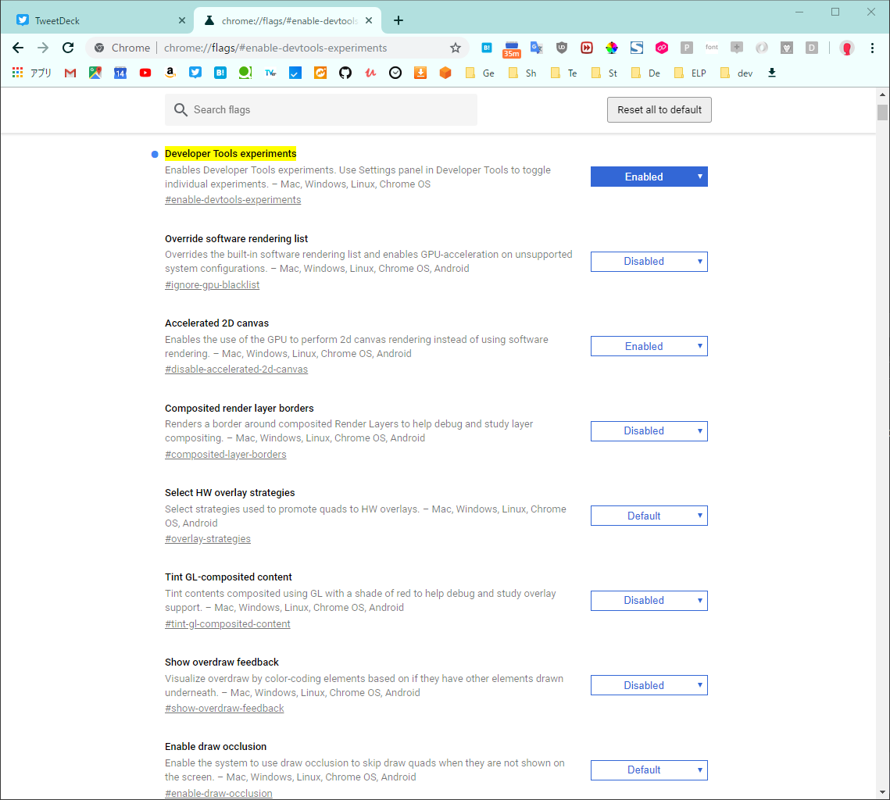
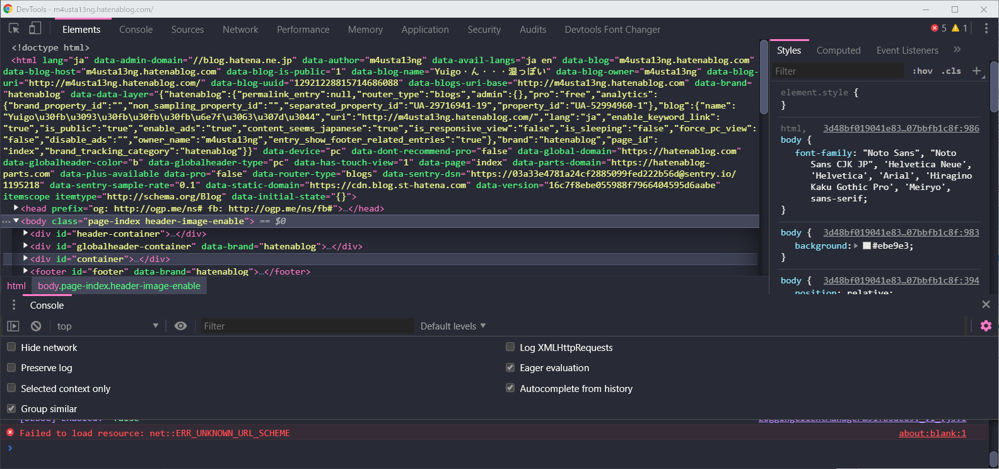
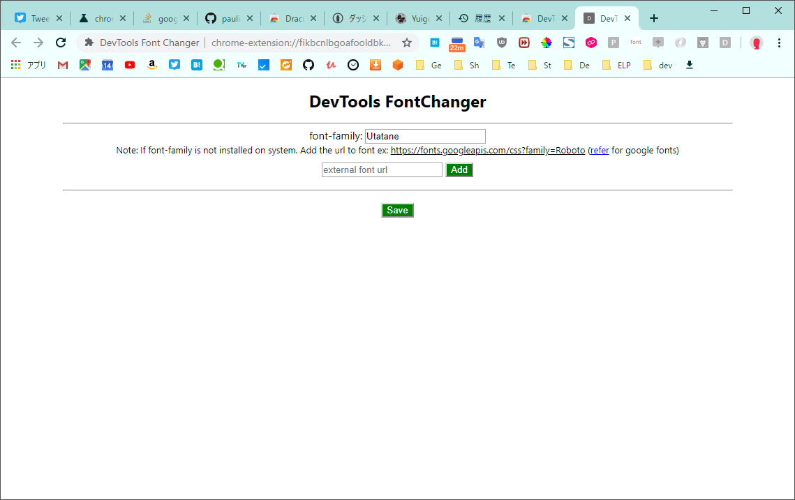
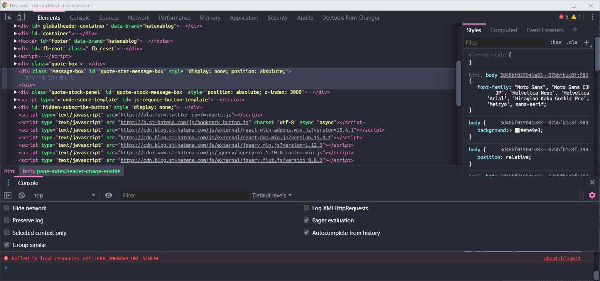

# Chrome DevTools: 見た目とフォントを変更する拡張機能

- [Chrome DevTools: 見た目とフォントを変更する拡張機能](#chrome-devtools-%E8%A6%8B%E3%81%9F%E7%9B%AE%E3%81%A8%E3%83%95%E3%82%A9%E3%83%B3%E3%83%88%E3%82%92%E5%A4%89%E6%9B%B4%E3%81%99%E3%82%8B%E6%8B%A1%E5%BC%B5%E6%A9%9F%E8%83%BD)
  - [概要](#%E6%A6%82%E8%A6%81)
    - [きっかけ](#%E3%81%8D%E3%81%A3%E3%81%8B%E3%81%91)
  - [環境](#%E7%92%B0%E5%A2%83)
  - [手順](#%E6%89%8B%E9%A0%86)
    - [カスタム UI テーマの適用を有効にする](#%E3%82%AB%E3%82%B9%E3%82%BF%E3%83%A0-ui-%E3%83%86%E3%83%BC%E3%83%9E%E3%81%AE%E9%81%A9%E7%94%A8%E3%82%92%E6%9C%89%E5%8A%B9%E3%81%AB%E3%81%99%E3%82%8B)
    - [拡張機能の追加](#%E6%8B%A1%E5%BC%B5%E6%A9%9F%E8%83%BD%E3%81%AE%E8%BF%BD%E5%8A%A0)
      - [テーマ](#%E3%83%86%E3%83%BC%E3%83%9E)
      - [フォント](#%E3%83%95%E3%82%A9%E3%83%B3%E3%83%88)
    - [補足: 自分でカスタムする](#%E8%A3%9C%E8%B6%B3-%E8%87%AA%E5%88%86%E3%81%A7%E3%82%AB%E3%82%B9%E3%82%BF%E3%83%A0%E3%81%99%E3%82%8B)
  - [参考](#%E5%8F%82%E8%80%83)

## 概要

Chrome DevTools の見た目とフォントを変更する方法を説明します。

### きっかけ

Vue.js の勉強を始めたことによって DevTool を使いだし、フォント変更したいなーと思ったし、DevTool ならそれなりの方法があるだろと思ったので。

## 環境

- OS
  - windows 10
- chrome
  - 73.0.3683.103（Official Build）（64 ビット）

## 手順

### カスタム UI テーマの適用を有効にする

後で説明する拡張機能による見た目の変更（カスタム UI テーマ）を適用するには以下の設定が必要になります。

- アドレスバーに `chrome://flags/#enable-devtools-experiments` と入力しエンターすることで設定画面に飛びます
- `Developer Tools experiments`を`Enabled`に設定します
- Chrome を再起動するよう促されるのでそのとおりに再起動します

- 再起動したら`Ctrl + Shift + i`などで DevTools を開き、更に`F1`などで設定画面を開きます
- サイドバーから`Experiments`を選択し、`Allow custom UI themes`のチェックを ON にします
  - WARNING が出ているので、よく読んだ上でチェックしてください
- これでカスタム UI テーマが使えるようになりました

### 拡張機能の追加

#### テーマ

- [Chrome ウェブストア](https://chrome.google.com/webstore/category/extensions)で`devtools theme`などのワードで検索します
- 良さそうなテーマが見つかったら`Chromeに追加`します
  - 私はVS Codeなどで使っている[Dracula](https://chrome.google.com/webstore/detail/dracula-devtools-theme/gdhgkfojgddhijhlnnnbopleoabkeife)にしました
- 新しくDevToolsを開くと変更が適用されています

#### フォント

- [DevTools Font Changer](https://chrome.google.com/webstore/detail/devtools-font-changer/fikbcnlbgoafooldbkgikejejhaddajg/related)を追加します
- アドレスバーの右にアイコンが追加されるので、右クリック -> オプションを選択します
- `font-family`に使用したいフォント名を入力します
  - 私は[Utatane](https://github.com/nv-h/Utatane)を使用しています
  - 下のテキストボックスはgoogle fontを使用する場合に入力するようです（試していません）。ローカルにあるフォントを使用する場合は入力不要です
- 変更したら`Save`を押下します

- DevToolsを開き直すとフォントの変更が適用されています

### 補足: 自分でカスタムする

https://github.com/paulirish/sample-devtools-theme-extension によると自分でカスタムする方法もあるみたいです。ちょっと読めていないのでリンクのみにとどめておきます。

## 参考

以下のstack overflowを参考にしました。

[google chrome devtools - Changing Developer Tools Font Face (family) - Stack Overflow](https://stackoverflow.com/questions/25473766/changing-developer-tools-font-face-family)
