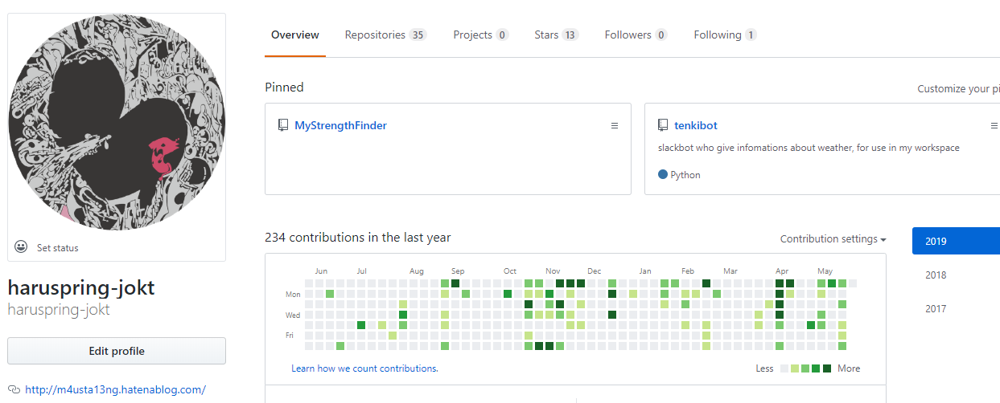

# 未経験からエンジニアをやる

## TL;DR

- コードを書く習慣を付ける
- 楽をする方法を探す
- 英語を恐れない
- 自分の環境を客観視する
- ひとつずつ学ぶ
- アウトプットが簡単にできる仕組みを作る

## はじめに

### 概要

未経験からエンジニアとして仕事についていく、エンジニアをしていることが少しでも楽しくなるにはどのような意識づけ、行動をしたらいいのだろうか、ということについて、主に私が 2 年間やってみての自責をもとに書いてみました。本当はもっといっぱいあるのですが、長くなりすぎると読まれなくなってしまうので、最初に思いついた 6 つのテーマについて説明します。

偉そうに書いていますが自分自身にハッパをかけているという意味もあるので許してください。

### 対象

- まったくの未経験でエンジニアになり、どのように成長すればいいのかわからない人
- 未経験から 1 ～ 2 年エンジニアとして仕事をしてきたけど、自分が成長しているかに自身が持てていない人（私）

### 補足：これは意識の高い文章か？

こういうことを書いていると意識が高いと思われるかもしれませんが、実のところその逆だったりします。なぜなら、以下に書いていることは緩やかに共通した目的意識があり、それは「余計なことをせず自分が本来頑張るべきところに注力できる仕組みをつくろう」というものです。

### 更新履歴

| 日付      | 内容                                                     |
| --------- | -------------------------------------------------------- |
| 2019/5/24 | とりあえず箇条書きで作成                                 |
| 2019/5/26 | 具体例の追加（`コードを書く習慣`、`楽をする方法を探す`） |

## 本題：未経験からエンジニアをするために

では、`TL;DR`に記載した 6 つのテーマについて、順番に説明していきます。

### コードを書く習慣を付ける

#### 反省

- 1 年目の 6 ～ 8 月は自社研修（自習）として Spring Framework 関連本を読む時間が多かったのですが、内容が難しくなかなか入ってきませんでした。
- 色々すっ飛ばしていきなりサンプルコードを写経すると、読むだけよりは断然内容が理解できるようになりました（難しいけど）。
- コードを書いて GitHub にプッシュするとプロフィールが緑に染まり、自分の実績が反映されているようで嬉しくなりました。

#### 対応策

- 手を動かしながら学ぶことを意識しましょう。
- 自分がどれだけ学習したのかを可視化するための仕組みをつくりましょう。
- Paiza ラーニングや Progate など、演習問題がついている学習サイトを利用すると、モチベーションにも繋がります。

#### 具体的には？

「毎日コードを書く」というアドバイスは色々なところでされていますが、経験のない状態では「コードを書く」ということもどうやって？とうまく自分の行動に落とし込めないと思います。コードを書くまでには、例えば環境構築…エディタを用意したり Java であれば IDE を設定したり、データベースを用意したりといきなり大きな壁にぶち当たることになります。

##### オンライン学習サービスを利用する

そういった環境構築の手間を省いてくれるのが学習サイトです。たとえば、以下のサイトではエディタをブラウザ上に用意してくれるので、環境構築を考えずにコードに集中することができます。更に、講義パートと演習パートが細かいステップごとに用意されており、自分が成長していることを可視化してくれるのでモチベーションに繋がります。

- [Progate](https://prog-8.com/)
- [paiza ラーニング](https://paiza.jp/works)

以下のサイトはエディタなどは自分で用意する必要がありますが、動画講座のためその設定手順も丁寧に説明してくれます。サイトによっては講師に直接質問をしたり、過去の質問を調べることもできるので、詰まったまま諦める、ということを回避できます。

- [Udemy](https://www.udemy.com/)
- [ドットインストール](https://dotinstall.com/)
- [Schoo](https://schoo.jp/)

##### 学習の記録を残す

技術書を読みながらコードを書いた場合は、必ずその記録を取るようにしましょう。最初はファイルサーバに保存で構いませんが、徐々に慣れてきたらバージョン管理システムを利用してみましょう。具体的には自分の書いたコードを Git にコミットし、GitHub にプッシュする、ということに挑戦します。必ずしも Git ではありませんが、バージョン管理システムの利用は開発現場では必須・かつ概念そのものを理解するのが意外と難しいので、まずは 1 人で練習することをおすすめします。

Git に入門する場合はほぼ必ず通るサイトを紹介しておきます。バージョン管理システムを使うと何が良いのか、ということも含めて教えてくれます。

- [サルでもわかる Git 入門](https://backlog.com/ja/git-tutorial/)

GitHubにcommit、pushしていくとこのように記録が残ります！緑に染まっていくとどんどん楽しくなるのでおすすめです。ちなみに、このブログも下書きを[GitHub](https://github.com/haruspring-jokt)に保存しています。

コード以外にも、「ここで詰まったけどこうしたらクリアできた」などの記録を残すことも重要です。これは実際の仕事でもチーム内に知見を残したり、同じ問題で何度も苦労しないようにするためには重要なスキルとなります。これも Git にドキュメントとして残してもよいですが、自分のブログや Qiita に投稿することも有効です。Qiita は調べ物をしていると必ず登場するサイトですが、Qiita が有用なサイトになったのは多くのエンジニアが自分の知見を共有しているからに他なりません。たとえ初心者であっても他のユーザーに役立つ情報を提供できる可能性があるので、（Qiita である必要はありませんが ）積極的に情報を記録しシェアする姿勢をつくりましょう。

- [Qiita](https://qiita.com/)

### 楽をする方法を探す

#### 反省

- 定形の繰り返し作業を手でやっていたら、時間はかかるわコピペに失敗して作業がやり直しになるわ散々だった。
- 文字の一括置換など、自分が面倒に思っていたことはすべてすでに解決方法が存在していた。

#### 対応策

- 自分が本当に注力しなければいけないこと以外は楽をすることを意識しましょう。
- 「これが便利になればいいのにな」という欲求は、ほとんどが誰かが解決する方法を持ち、インターネットに公開しています。欲求があったら調べてみる、という習慣をつけましょう。
- ほとんどはツールのインストール、エディタのプラグインを導入などすることによって解決するでしょう。
- たとえば Python を使えるようになるとエクセルやブラウザの自動化ができるようになります。作成したら他の人にも配るとみんなが幸せになります。
- 手作業にはミスの可能性がある、という前提を意識しましょう。自動化はミスをなくす仕組みでもあります。

#### 具体的には？

例えば、Java の研修を経ているのであればすでに IDE というツールの恩恵を受けているはずです。最初の数文字を入力しただけですぐに候補が登場し、適切なクラスを使用することができるようになっています。また、間違った文法を用いていたりするとコンパイルエラーを示してくれます。まさか、IDE を使うことは成長に繋がらないからメモ帳にコードを書け、という指導をする人はいないはずです（なぜこのコードを書くのか、ということを理解する必要はありますが別問題です）。

IDE 以外のツールに頼ってはいけないのでしょうか。そんなことはありません！どんどん便利なツールを使っていきましょう。たとえば、Java の研修をしていたとき、HTML や CSS はどのように書いていたでしょうか。Eclipse ではあまり丁寧にサポートしていない部分もあるので、結構苦労したのではないでしょうか。この場合、私なら VS Code や Atom といった高機能エディタと呼ばれるものを使用します。

- [VS Code](https://code.visualstudio.com/)
- [Atom](https://atom.io/)

高機能エディタはそのままでも多くの言語をサポートして色分け表示やオートコンプリートなどの補助をしてくれますが、その本領はプラグインにあります。例えば VS Code では「拡張機能」と呼ばれるプラグインを用途に合わせて追加していくと、HTML のタグを片方書くともう片方の「閉じタグ」を自動で作ってくれたり、インデントを揃えて自動フォーマットしてくれたり、ブラウザを開かなくてもプレビューを右半分に表示してくれたりと様々なサポートをしてくれるようになります。

拡張機能はユーザーによって大量に作成、公開されているので、ほぼ「なんでもできる」と言っていいでしょう。私の場合は、Python の実行環境を VS Code 上に構築し、（これはもともとの機能ですが）内部でターミナルを開くこともデバックもできるので、ほぼ IDE と同等の環境をつくることができます。もちろん Java の環境もつくれますよ！

エディタについては人それぞれお気に入りがあるので、深く言及すると「宗教戦争」になってしまいますが、未経験でわからないことが多い場合は上記の 2 つのうちのどちらかが親切で良いと思います。

参考までに、VS Code ではこんなことができるよ！という記事を紹介します。GIF を見ているだけでもワクワクすることは間違いありません！

- [VSCode のオススメ拡張機能 24 選 (と Tips をいくつか)](https://qiita.com/sensuikan1973/items/74cf5383c02dbcd82234)
- [Vim 三連覇なるか!? 激動の 2018 年人気 NO.1 テキストエディタを発表！](https://job-draft.jp/articles/323)

「楽をする」ことを意識し続けると、自動化の分野に興味を持つと思います。アプリケーションのビルドやデプロイの自動化（CI/CD）、ウェブブラウザの操作自動化（Selenium、Puppeteer、Cypressなど）、環境構築の自動化（Ansible、Dockerなど）、テストの自動化（JUnitなど）はチーム開発では必須のスキルなので、単に楽をする・いい意味でサボるということが業務になる可能性がある、ということです。

### 英語を恐れない

#### 反省

- 技術的にわからないことがあるとググるのは同じですが、日本語のページと英語のページがあるとついつい前者だけを見てしまいます。
- しかし、英語のページに仕方なく行くとすんなり答えが見つかることも多いです。
- 英語を読むのが辛い、という場合は翻訳ツールを使います。ページ全体を翻訳するとわかりにくいですが、部分翻訳すると的確に読むことができます。
- エンジニアに関連する英語はだいたい決まっているので、すぐに慣れると思います。

#### 対応策

- 公式ドキュメントや、「このサイトでは答えが見つかりやすい」というお気に入りのサイトを持っておくと調べ物の範囲が狭まりスピードに繋がります。
- コードを見たいときは GitHub リポジトリを検索します。`spring boot security example`などで検索すると良いでしょう。
- 情報の新しさ・バージョンにも気をつけます。たとえば Python は 2 系と 3 系で言語仕様が大きく異なります。
- 検索するときも英単語を組み合わせたり、エラーメッセージをコピペすることで欲しい情報にたどり着きやすくなります。

#### 具体的には？

**TBD**

### 自分の環境を客観視する

#### 反省

- 3 年目ともなると色々な現場に入っていますが、それぞれが全く違う習慣、文化、価値観を持っていることがわかりました。
- ある現場では良しとされていた習慣でも、ある現場では禁止されている、レビューの際に強く指摘される、ということも往々にしてあります。
- しかし、新卒で初めての現場に入ると、その現場＝開発の常識、と捉えてしまいがちです。

#### 対応案

- 色々な現場を見る、というのは時間が必要になるので、勉強会やもくもく会など外部のコミュニティに参加することを通して異なる文化に触れましょう。
- 外部のコミュニティの方がキラキラしていて良いように見えますが、一長一短あります。それぞれのいいところ、悪いところを自分の中で整理しましょう。
- 勉強会などに行くと、自分と同じような立場の人がいっぱいいること、反対に技術書の著者と直接話しができたりと上記以外のメリットも多いです。

#### 具体的には？

**TBD**

### ひとつずつ学ぶ

#### 反省

- エンジニアが習得するべき技術は膨大にあり、何から手をつければいいのかわからず途方にくれた。
- 色々考えた結果諦めて、まずは Python から、Spring、その次は…と学ぶことを 1 つに制限したらスッキリして、地道ながら勉強が進んできた（かなり最近）。

#### 対応案

- カンバンの考え方を自分の勉強にも取り入れ、WIP（着手中）の数を 1 ～ 2 に制限しましょう。
- やることを制限すると重い腰が上がりやすくなります。
- どう学べばいいのかわからないときは、動画講座が有効です。環境構築からサポートしてくれるので序盤で詰まる可能性が低くなります。

#### 具体的には？

**TBD**

### アウトプットが簡単にできる仕組みを作る

#### 反省

- アウトプット（GitHub へのプッシュ、Qiita への公開、ブログを書く）が面倒だった。
- 学習しながら Markdown でメモを残すようにしたら、それをそのまま記事にできるので、アウトプット用の作業が簡単になった。

#### 対応案

- インプット（勉強、現場での経験）をしたらアウトプットする習慣をつけましょう。アウトプットの際に鮮明になったり、説明するために別の知識が身につくようになります。
- Markdown 記法は GitHub、Qiita、各種ブログなどで共通して使えるので、メモをいちいち整理する手間がなくなります。VS Code や Atom などのエディタは標準で対応しており、設定やプラグインを利用すると HTML や PDF を生成することもできるので、Markdown を知らない人にも配れるようになります。
- インターネット上にアウトプットする際は、著作権や機密情報などに注意しましょう。機密情報を省いた状態であれば、現場で学んだフレームワークの知識などをブログなどに書くことができます。Qiita では投稿可能な記事の内容が決まっているのでルールを把握した上で投稿しましょう。

#### 具体的には？

**TBD**
