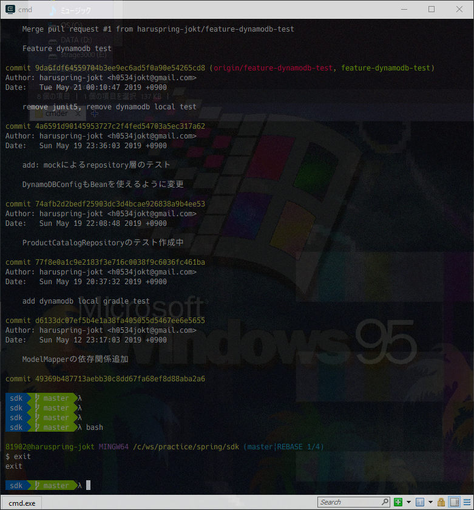
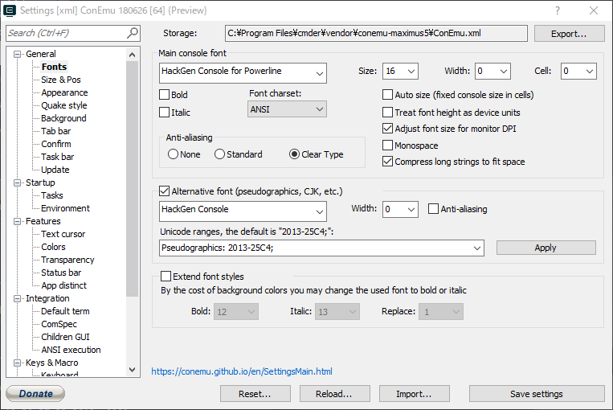
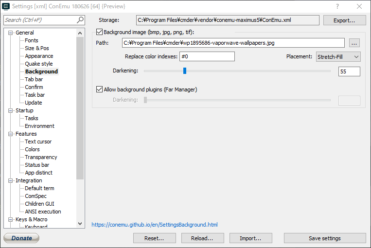

# 作り込みすぎないcmderの設定

## 概要

cmderの設定をちょこちょこしてwindowsのコマンドプロンプトから卒業します。ただし、設定は作り込みすぎず最低限の設定を目指します！

## 参考リンク

だいたいの手順は以下のサイトとほぼ変わりませんが、gitやPowerlineなどの細かい設定は飛ばしています。

[Cmderでオシャレにcmd.exeを使う -前編-](https://blog.mamansoft.net/2018/11/18/use-cmd-elegant-on-cmder-phase1/)

[Windows + Cmderでカッコよくて見やすいターミナル、コンソール環境を作る(めんどくさがり屋な人向け) - Qiita](https://qiita.com/thrzn41/items/7dd3b1ec5e50bae9f03b)

## 手順

最終的にはこんな見た目になるのを目指します。



### cmderのインストール

公式サイトからcmderをインストールします。「Download Full」の方を選択してください。

https://cmder.net/

ダウンロードしたらzipを解凍して、中身を`C:\Program Files\cmder`にコピーします。C直下でも構いませんが、特に理由がなければここでOKです。

コピーしたら`Cmder.exe`を起動します。権限がなくて起動できない、といったメッセージが表示されたら、右クリックして「管理者として実行」します。初回の設定が済んだらあとは一般ユーザーでも利用できるようになります。

### Powerlineの有効化

#### HackGenのダウンロード

Powerline対応フォントは参考リンクに記載がありますが。つい最近できた「HackGen」というフォントも対応しているので、今回はそちらを使います。記事作成時点でバージョン0.5.0がリリースされていますが、「HackGen Console for Powerline」というフォントが同梱されているので、これを使うことで対応OKとなります。

https://github.com/yuru7/HackGen/releases

#### 追記：HackGenバージョンとCmder対応について

**2019-05-31 現在、HackGenはv0.6.3がリリースされていますが、これをCmderに使用するときれいに表示されない現象が（少なくとも私の環境で）発生しています。v0.5.0は動作を確認しています。**

zipをダウロードしたら解凍して中身のフォントファイルをインストールすればOKです。

インストールしたら、cmderの設定（`win + Alt + P`）から`General > Fonts`に行き、フォントを設定します。



`Monospace`のチェックを外しておくと良いみたいです。

#### Cmder-powerline-promptのダウンロード

任意のフォルダで以下のコマンドを叩き、取得したプロジェクトの`.lua`ファイルを、cmderのconfigディレクトリ以下にコピーします。

```sh
git clone https://github.com/AmrEldib/cmder-powerline-prompt
```

### 背景の変更

設定の`General > Backend`で背景画像を設定できます。`Replace color indexes`に`#0`を設定すると、Powerlineの色が消えてしまう問題を回避できます。今回は https://wallpapercave.com/ で最近ハマっているvaporwaveの画像を拾ってきました。



### cmder起動時のカレントをホームディレクトリに

デフォルトではcmderをインストールしたフォルダから起動しますが、面倒なのでホームディレクトリで起動するよう変更します。

`Startup > Tasks`の左画面から`{cmd::Cmder}`を選び、右下のテキストエリアに以下のように入力します。

```sh
-new_console:d:C:\Users\{ユーザー名} cmd /k ""%ConEmuDir%\..\init.bat" -new_console:d: %USERPROFILE% "
```

または、各タスク設定画面の`Startup dir...`ボタンからも選択することができます。

うまくホームディレクトリから開始しない場合は申し訳ないですが参考リンクを調べてみてください。

### プロンプトのλを$にする

デフォルトのλ記号は半角でなく面倒ごとに巻き込まれる可能性があるので、$に変更します。

cmderインストールフォルダの`config\powerline_core.lua`のだいたい115行目あたりを以下のように変更します。

```lua
    -- plc_prompt_lambSymbol = "λ"
    plc_prompt_lambSymbol = "$"
```

ただ、私の場合はこれだけでは変更が適用されなかったので、`vendor/clink.lua`にも同様の変更をしてください。だいたい50行目くらいにあります。すでに変更適用されていた場合は実施不要です。

```lua
    -- local lambda = "λ"
    local lambda = "$"
```

### コマンドをプロンプト1行目に入力する

デフォルトだとコマンド入力はプロンプトの次の行になりますが、これを同じ行に入力できるよう変更します。`config\powerline_core.lua`のだいたい100行目を変更します。

```lua
-- Symbols
-- newLineSymbol = "\n"
newLineSymbol = ""
```

### Powerline強化の設定は飛ばす

参考リンク通りにPowerlinkの設定を変えましたが、うまく設定されなかったのでここは飛ばします。そのままでも十分快適に見られるようになっているはずです。

