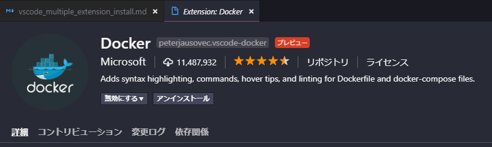
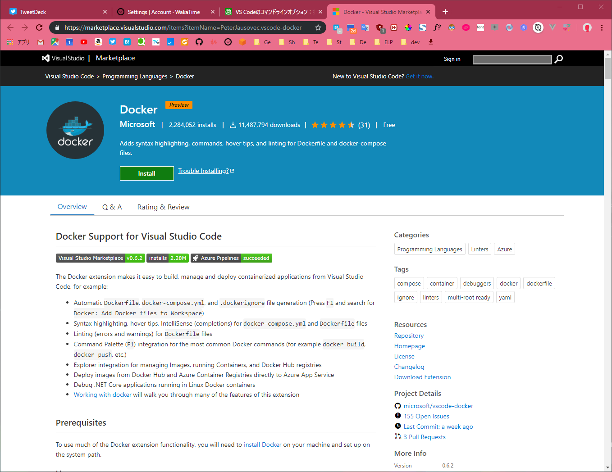
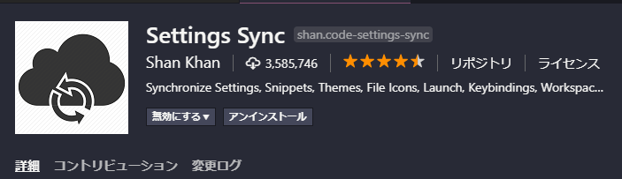

# VS codeで複数の拡張機能を一度にインストールする

## 概要

タイトルの意味そのままにスッキリ行かない策ですが、VS Codeで複数の拡張機能を一度にインストールする方法を自分用にメモ。ざっくり2通り紹介します。

## 環境

windows10で実施しました。とはいっても.batを使っているということだけなので、どのOSでも工夫すればすぐにできるようになります。

## 前提

- VS Codeをインストール済み
- `code`コマンドが使用可能になっている
  - インストール時に同時に設定してくれることがほとんどですが、後からパスを通せばOKです
  - 私の場合はシステムにインストールしたため、`C:\Program Files\Microsoft VS Code\bin`にパスを通しています
- シチュエーションとしては、すでにインストールするべき拡張機能一覧がわかっているけど、1つずつインストールしないといけないからめんどいなあ、という場面を想定しています

## 1. codeコマンドを使う

`code`コマンドでは以下のようにして拡張機能をインストールできます

```sh
code --install-extension <extension-id | path-to-vsix>
```

`<extension-id | path-to-vsix>`は何を指しているかと言うと、下画面で言うところの`peterjausovec.vscode-docker`、



もしくは下画面のアドレスバーで言うところの`PeterJausovec.vscode-docker`です。



このうちいずれかを入力して、以下のようにして叩けばインストールしてくれます。

```sh
code --install-extension peterjausovec.vscode-docker
code --install-extension PeterJausovec.vscode-docker
```

そして、複数インストールする方法ですが、以下のようにします。

```sh
code --install-extension peterjausovec.vscode-docker code --install-extension bbenoist.vagrant code --install-extension chrmarti.regex
```

`code --install-extension`が重複していますが今のところはこういう形にするしかないようです。

### 新マシンに移行する場合の対処法

マシン入れ替えにあたり拡張機能を入れ直す場合は、まず移行元で以下のコマンドを叩きます。

```sh
code --list-extensions
```

こうすることで現在インストールされている拡張機能一覧が表示されます。

```
abusaidm.html-snippets
AlanWalk.markdown-toc
almenon.arepl
batisteo.vscode-django
bbenoist.vagrant
bibhasdn.django-html
bibhasdn.django-snippets
christian-kohler.path-intellisense
chrmarti.regex
...
```

この一覧に対して各行の先頭に`code --install-extension `、末尾に` ^ `を追記し、適当な名前でbatファイルとして保存します。マルチカーソルや置換機能を使ってあげれば楽だと思います。

```bat
code --install-extension abusaidm.html-snippets ^
code --install-extension AlanWalk.markdown-toc ^
code --install-extension almenon.arepl ^
code --install-extension batisteo.vscode-django ^
code --install-extension bbenoist.vagrant ^
code --install-extension bibhasdn.django-html ^
code --install-extension bibhasdn.django-snippets ^
code --install-extension christian-kohler.path-intellisense ^
code --install-extension chrmarti.regex ^
...
```

保存したファイルを新マシンに渡して、バッチを叩けばあとは順番にインストールされるのを待つだけです。

## 2. 拡張機能Setting Syncを利用する

実は、こういうマシン間での拡張機能を同期するための拡張機能が存在しているので、これを利用するというのも手です。



利用方法に関しては、詳細に説明されているリンクがあったので雑ですが以下を参照してください。

[VSCode(Visual Studio Code)の設定を同期させる拡張機能「Setting Sync」が便利 | カレリエ](https://www.karelie.net/vscode-setting-sync/)

この方法のポイントとしては、

- GitHub Gistを利用するためGitHubアカウントが必要
- トークンは一度しか見られないのでどこかに保存しておく必要がある
- 会社や開発現場のマシンと同期していいかはルールに従い判断する必要あり

といったところでしょうか。利用は自己責任となりますが、拡張機能だけでなく設定も同期することができるのでかなり便利です。一度トークンを設定すればいずれかのマシンで変更するたびに残りのマシンにも同期してくれるようにもなります。

## 参考

[VS Codeのコマンドラインオプション：拡張機能編：Visual Studio Code TIPS - ＠IT](https://www.atmarkit.co.jp/ait/articles/1812/28/news037.html)

[VSCode(Visual Studio Code)の設定を同期させる拡張機能「Setting Sync」が便利 | カレリエ](https://www.karelie.net/vscode-setting-sync/)
